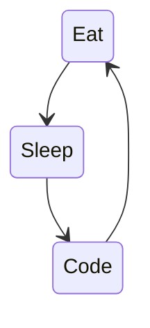

### :point_left: This is me

<!--
**deepakmahakale/deepakmahakale** is a ✨ _special_ ✨ repository because its `README.md` (this file) appears on your GitHub profile.

Here are some ideas to get you started:
-->
#### More about me

<table>
  <tr>
    <td>
      
    </td>
    <td>
      
    </td>
    <td>
      
    </td>
    <td>
      
    </td>
  </tr>
  <tr>
    <td>
      
    </td>
    <td>
      
    </td>
    <td>
      
    </td>
    <td>
      
    </td>
  </tr>
</table>

#### Open Source Contributions

<table>
  <tr>
    <td>
      <a href="https://github.com/rails/rails/pulls/deepakmahakale?q=is%3Aclosed" title="Rails">
        :file_folder:
        &nbsp;
        Rails
      </a>
      - Web-application framework
      
    </td>
  </tr>
  <tr>
    <td>
      <a href="https://github.com/spree/spree/pulls/deepakmahakale?q=is%3Aclosed" title="Spree">
        :file_folder:
        &nbsp;
        Spree
      </a>
      - Open Source multi-language/multi-currency/multi-store eCommerce platform
      
    </td>
  </tr> 
  <tr>
    <td>
      <a href="https://github.com/zombocom/wicked/pulls/deepakmahakale?q=is%3Aclosed" title="Wicked">
        :file_folder:
        &nbsp;
        Wicked
      </a>
      - Step-by-step wizards in rails controllers
      
    </td>
  </tr>
  <tr>
    <td>
      <a href="https://github.com/TDAmeritrade/botbuilder-storage-postgres/pulls/deepakmahakale?q=is%3Aclosed" title="Botbuilder Storage Postgres">
        :file_folder:
        &nbsp;
        Botbuilder Storage Postgres
      </a>
      - Botbuilder adapter for Postgres storage.
      
    </td>
  </tr>
  <tr>
    <td>
      <a href="https://github.com/forem/forem/pulls/deepakmahakale?q=is%3Aclosed" title="Forem">
        :file_folder:
        &nbsp;
        Forem
      </a>
      - dev.to platform
      
    </td>
  </tr>
  <tr>
    <td>
      <a href="https://github.com/coorasse/heroku-api-postgres/pulls/deepakmahakale?q=is%3Aclosed" title="Heroku API Postgres">
        :file_folder:
        &nbsp;
        Heroku API Postgres
      </a>
      - A Ruby library to invoke Heroku Postgres APIs
      
    </td>
  </tr>
  <tr>
    <td>
      <a href="https://github.com/RobinHerbots/Inputmask/pulls/deepakmahakale?q=is%3Aclosed" title="Inputmask">
        :file_folder:
        &nbsp;
        Inputmask
      </a>
      - Input Mask plugin
      
    </td>
  </tr>
  <tr>
    <td>
      <a href="https://github.com/howdyai/botkit/pulls/deepakmahakale?q=is%3Aclosed" title="Botkit">
        :file_folder:
        &nbsp;
        Botkit
      </a>
      - Open source developer tool for building chat bots, apps and custom integrations for major messaging platforms.
      
    </td>
  </tr>
</table>

#### Projects of Interest

<table>
  <tr>
    <td align="left">
      <a href="https://github.com/deepakmahakale/facebook_birthday_export" title="Facebook Birthday Export">
        :file_folder:
        &nbsp;
        deepakmahakale/facebook_birthday_export
        
      </a>
    </td>
    <td align="left">
      <a href="https://github.com/deepakmahakale/wanda" title="Wanda">
        :file_folder:
        &nbsp;
        deepakmahakale/wanda
        
      </a>
    </td>
  </tr>
  <tr>
    <td align="left">
      <a href="https://github.com/deepakmahakale/wordle" title="Onestop Install">
        :file_folder:
        &nbsp;
        deepakmahakale/wordle
        
      </a>
    </td>
    <td align="left">
      <a href="https://github.com/deepakmahakale/read-time" title="Read Time">
        :file_folder:
        &nbsp;
        deepakmahakale/read-time
        
      </a>
    </td>
  </tr>
    <tr>
    <td align="left">
      <a href="https://github.com/deepakmahakale/onestop-install" title="Onestop Install">
        :file_folder:
        &nbsp;
        deepakmahakale/onestop-install
        
      </a>
    </td>
  </tr>
</table>

#### Rails Templates [WIP]

<table>
  <tr>
    <th align="left">
      <a href="https://github.com/deepakmahakale/rails-template" title="Rails Template">
        :file_folder:
        &nbsp;
        deepakmahakale/rails-template
        
      </a>
    </td>
  </tr>
</table>
